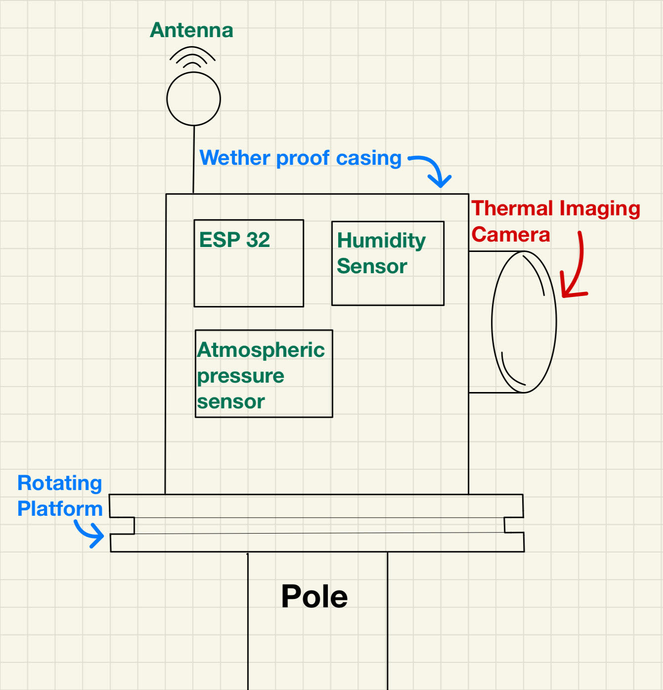

## How we will respond to the Wildfire issues:
Our main takeaway from the presentation was that human-caused fires are a large percent of our wildfire issues. According to the National Park Service, 85% of wildfires are human-caused. Because of this, our device will focus on human-made fire prevention. While some forest fires are completely out of our control, such as ones caused by lightning strikes, there is no reason why we shouldn’t be able to establish preventative measures for ourselves.

With our product, we wish to accomplish this basic task of fire prevention while also improving the issues with products currently on the market, such as battery life, physical durability, etc. Our audience in this context will be local fire departments/agencies, first responders, and larger national drone companies. Fire departments and first responders will likely be interested in using our product to help make their lives easier, and drone companies may want to invest in our product if it proves to be both reliable and financially viable.

---

  
<strong>Brainstorming Ideas</strong>

  

    
      
    
  

  
<strong>Heat Seekers project video</strong>

  

    <iframe width="700" height="400" 
            src="https://youtube.com/embed/FpO_FNnwHrE" 
            title="YouTube video player" 
            frameborder="0" 
            allow="accelerometer; autoplay; clipboard-write; encrypted-media; gyroscope; picture-in-picture; web-share" 
            allowfullscreen>
    </iframe>
  

  
<strong>Design Concept Sketch</strong>

  

    
  

