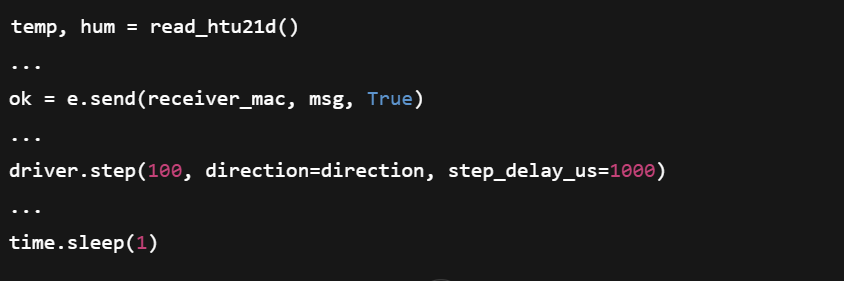

## <strong>Lessons Learned</strong>

* Even though our budget wouldn't have allowed it, we should've bought more than one ESP32 module.
* Should've been ahead of schedule on component selection. We could've saved a few dollars on re-orders.
* Although the micro USB-C programmer seemed like a solid idea, we should've attached some connections for an external programmer.
* We should've put more time into prep work when it comes to the thermal camera.
* A more concrete idea on how much data the ESP32 can handle would've saved us some struggle later on.
* A plan to deal with how much heat the actuator would be giving off with continuous rotation
* Although we struggled with alot of the fundamental coding for our project, we would have liked to have been able to not only send images but messages that would've increased our projects ability to truly communicate the issues we were trying to solve.
* Although soldering was most likely not an issue that prevented our success, we think the use of an oven for our surface mounted parts, could have saved us some time, thus finding the programming issues sooner.
* Our final PCB came out well, but troubleshooting our issues could have possibly been easier if we had multiple PCB's for each subsystem connected externally.
* Although our thermal camera was hands down the most expensive part in our project, we probably could've saved money with further research into some of the other components.

## <strong>Recommendations for future students</strong>
* Once you have decided who's responsible for what subsystem, as soon as you can, start building your PCB in your chosen software. If you get it done soon enough, easier said than done, you can get peralta to print a proto-board to work on and work out issues before you order the final board(s) from JLC.
* Communication between teammates is super important.
* Have the ability to pull yourself back for the sake of time. We all have wonderfully extravagant ideas but we have less than 5 months to create it. 
* If you signed yourself up for a part that you later realized you are not able to accomplish, ask for help. 
* This class is tough but getting sleep will make it seem less tough.

## <strong>Version 2.0</strong>

**Higher-level communication architecture changes**

Our communication architecture is essentially: the ESP32 reads the HTU21D over I²C, drives the DRV8825 directly with GPIOs, and then pushes a simple status string over ESP-NOW to a single receiver. All of this happens inside one big while True loop. For a Version 2.0, we could redesign this as a more clearly layered architecture with separate tasks for sensing, motion control, and wireless communication, all talking through a small internal message queue or shared data structure instead of a single monolithic loop. On the ESP32 (the central block in the block diagram) we could've created three logical modules: a Sensor module that owns the I²C bus and periodically publishes structured temperature/humidity readings; a Motion module that exposes commands like “rotate N steps” or “scan 360°”; and a Comms module that is the only part that knows about ESP-NOW peers and the on-air protocol. This would make it much easier to change the wireless method later (for example, switching from ESP-NOW to MQTT or Wi-Fi mesh) without touching sensor or motor code.

Architecturally, we could also upgrade the over-the-air protocol itself. Right now messages are plain strings like T:23.5C H:45.2% Count:12. It worked for the lab demo, but it does not scale well or support new features.In our version 2.0 it would be ideal to define a small, versioned protocol with fields for message type (telemetry vs. command), node ID, sequence number, and a simple checksum. Even something lightweight like {"type":"telemetry","id":310,"t":23.5,"h":45.2,"seq":12} (JSON) or a binary frame with a header, payload, and CRC would immediately improve robustness. This would let us easily add new fields (battery voltage, motor state, fault codes) without breaking existing receivers, and the sequence number and checksum would make it easier to detect dropped or corrupted packets.

**Improvements tied to the schematic and hardware**

When we reflect on the schematic, each subsystem—ESP32 module, 3.3 V supply, USB-C interface/ESD, humidity sensor, thermal camera, and the DRV8825 + NEMA 17—has been drawn as its own block. That structure suggests a natural modular communication pattern we did not fully exploit in our design. In a Version 2.0 design, we would treat each subsystem as a “logical endpoint” with well-defined interfaces. For the sensors (MLX90640 and HTU21D), that means reserving I²C purely for sensor traffic and keeping any extra configuration or debug interfaces (like UART) separate. For the DRV8825 subsystem,we should strongly consider offloading step generation from software bit-banging in driver.step() to hardware peripherals in the ESP32—such as using an LED PWM channel or a timer interrupt to generate step pulses at a controlled rate. Then the communication between the Motion module and the driver subsystem becomes higher-level (“rotate 90° at speed X”) instead of individual microstep toggling, which would reduce timing sensitivity and CPU load.

The schematic also shows how the power supply, USB-C, and ESD protection are integrated. In a more thought version, we would extend the communication design to include system-level health monitoring. For example, we could add an ADC channel to monitor 12 V and 3.3 V rails, then periodically include that information in the ESP-NOW telemetry frames. That way, the remote station can detect low-voltage conditions or brownouts that might affect communication or motor performance. At the hardware level this is a small addition, but architecturally it turns the ESP32 into a more complete “system supervisor” rather than just a sensor bridge.

**Software structure, debugability, and protocol robustness**

From the code listing it’s clear that the current implementation mixes several responsibilities in the main loop: reading the HTU21D, formatting a status string, sending ESP-NOW, and immediately stepping the motor:

  

For Version 2.0, we could reorganize this into clearly separated modules and possibly asynchronous tasks. One possible path is to keep MicroPython but move to uasyncio: a sensor_task() that reads I²C every N seconds, a comms_task() that takes the latest data and sends it, and a motor_task() that handles rotation sequences. Either way, the communication architecture benefits because radio activity, sensor sampling, and motor stepping no longer block each other. This would also help debugability: if packets stop arriving, we can check whether the comms task is still running independently of the motor.

The current ESP-NOW usage also sends and immediately blocks for an acknowledgment (e.send(..., True)) without much error handling. to update that, we could implement retries, backoff, and status callbacks. For example, we could register send/receive callbacks, log RSSI(recieved signal strength indicator) and delivery success, and maintain a small state machine: DISCONNECTED, DEGRADED, OK. If the link degrades, the system could automatically reduce motor activity, lower the report rate, or log the issue for later analysis, which would significantly improve robustness over the air.

**Peripheral usage, scaling, and “future you” improvements**

Finally, an updated version of our project would be an opportunity to think scale and if the project grew from a single Heat Seeker node to a network of many nodes. In that world, the block diagram might show one ESP32 as a gateway connected to Wi-Fi or MQTT, and several remote nodes communicating via ESP-NOW or ESP-Mesh. The communication architecture would need proper addressing, perhaps a topic-like hierarchy, and a clear distinction between commands (e.g., “start scan,” “go to home,” “set motor speed”) and telemetry (sensor readings, temperatures, fault flags). Our current design can be seen as a prototype of that, but Version 2.0 would explicitly design for multiple nodes from the start.

Another improvement area is debug and test hooks. Right now, the only visibility into the system is print statements over the REPL. With Version 2.0, we could add a dedicated “debug channel” that can stream internal state or error information over ESP-NOW or a secondary UART. We could also introduce compile-time or run-time flags to switch between “demo mode” and “diagnostic mode,” where the communication protocol sends more expansive messages (including raw I²C error codes, DRV8825 fault states, and home switch status). This would make field debugging much easier, especially when the device is deployed on a pole somewhere and serial access isn’t practical.

Altogether, Version 2.0 of our communication architecture would move from a single, tightly coupled control loop and ad-hoc text messages to a modular, layered, and versioned system: hardware subsystems with clear interfaces, software modules for sensors/motion/comms, a robust on-air protocol with error checking and addressing, and better use of ESP32 peripherals for timing and reliability. These changes would not just make the system more “polished”; they would make it easier to extend, debug, and trust when deployed in real wildfire-prevention scenarios.

