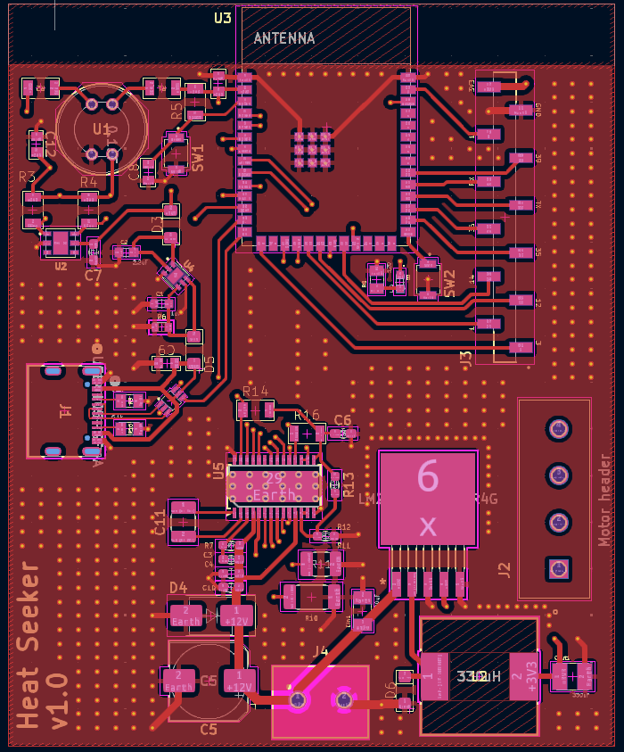
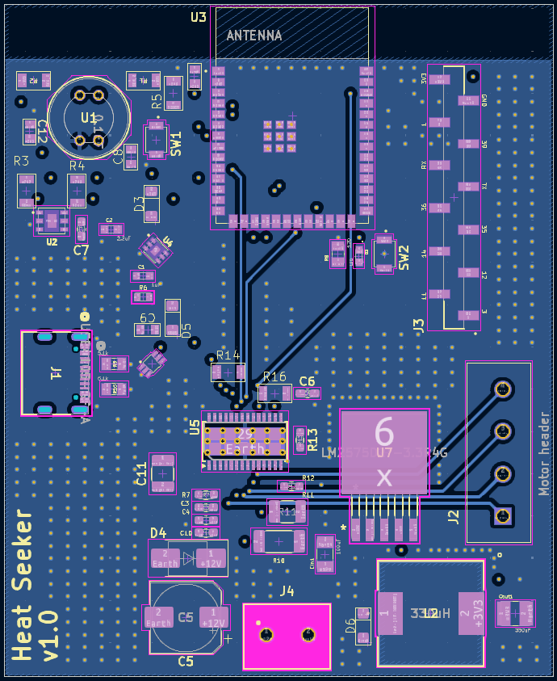

  
  
  
  

## Schematic

  <iframe
    src="/EGR314-2025-F-310/Images/Main1.pdf#view=FitH"
    width="100%"
    height="100%"
    style="border:1px solid #ddd;"
  ></iframe>

  <a href="/EGR314-2025-F-310/Images/Main1.pdf" target="_blank" style="
    padding: 10px 18px;
    background:#c62828;
    color:white;
    border-radius:6px;
    text-decoration:none;
    font-weight:bold;">
    Download Schematic (PDF)
  </a>

