# Major Hardware Selection

 

<h2>Microcontroller Selection</h2>

<table>
  <thead>
    <tr>
      <th>Component</th>
      <th>Image</th>
      <th>Advantages</th>
      <th>Disadvantages</th>
      <th>Link</th>
    </tr>
  </thead>
  <tbody>
    <tr>
      <td><strong>ESP32-WROOM</strong></td>
      <td>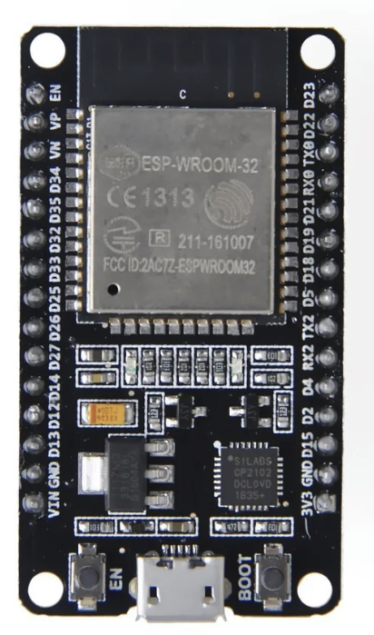</td>
      <td>
        - Currently using in class 
        - Plenty of docs/examples 
        - Good peripherals for class labs
      </td>
      <td>
        - Built in antenna 
        - Lower library ecosystem than ARM
      </td>
      <td><a href="https://www.digikey.com/en/products/detail/espressif-systems/ESP32-DEVKITC-32UE/12091813">Datasheet</a></td>
    </tr>
    <tr>
      <td><strong>Raspberry Pi Pico</strong></td>
      <td>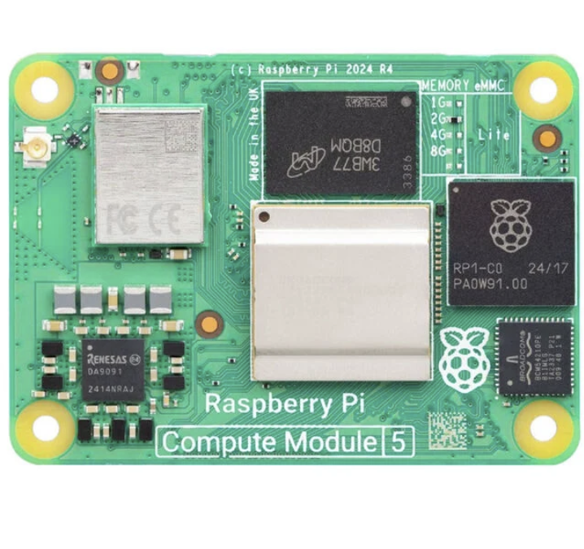</td>
      <td>
        - Large community and libraries 
        - Can handle advanced tasks like AI and image processing
      </td>
      <td>
        - More power hungry 
        - More expensive than ESP32 or Arduino 
        - Overkill for simple sensor/motor tasks 
      </td>
      <td><a href="https://www.sparkfun.com/raspberry-pi-5-16gb.html?src=raspberrypi"> Datasheet</a></td>
    </tr>    
    <tr>
      <td><strong>Arduino Uno - R3</strong></td>
      <td>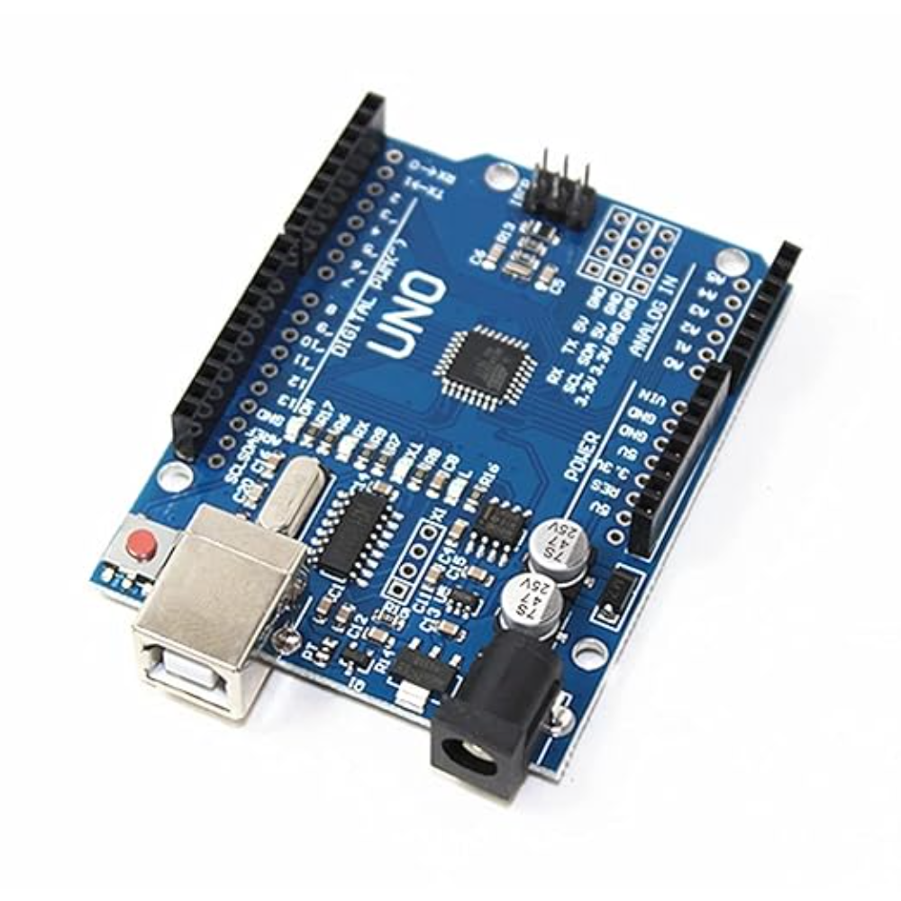</td>
      <td>
        - Large community and libraries 
        - Very low power consumption. 
        - Extremely simple 
      </td>
      <td>
        - Limited processing power 
        - No built-in Wi-Fi or Bluetooth
      </td>
      <td><a href="https://www.sparkfun.com/arduino-uno-r3.html"> Datasheet</a></td>
    </tr>    
    <tr>
      <td colspan="5" style="text-align:center; font-weight:bold; background:#f0f0f0;">
        ✅ Our Choice: <u>ESP32-WROOM</u> – Best balance of cost, features, and documentation for our needs.
      </td>
    </tr>
  </tbody>
</table>

<h2>Power Regulator Selection</h2>

<table>
  <thead>
    <tr>
      <th>Component</th>
      <th>Image</th>
      <th>Advantages</th>
      <th>Disadvantages</th>
      <th>Link</th>
    </tr>
  </thead>
  <tbody>
    <tr>
      <td><strong>LM2575D2T-3.3R4G</strong></td>
      <td>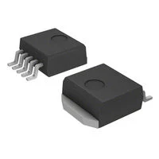</td>
      <td>
        - Have used in the lab 
        - Is surface mount 
        - Has a heat sink 
      </td>
      <td>
        - Harder to solder as all feet are on one side 
        - We need to use it 
      </td>
      <td><a href="https://www.digikey.com/en/products/detail/onsemi/LM2575D2T-3-3R4G/1476688">Datasheet</a></td>
    </tr>
    <tr>
      <td><strong>LF33CV</strong></td>
      <td>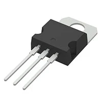</td>
      <td>
        - Don't need to buy the part 
        - Smaller footprint than surface mount
      </td>
      <td>
        - Is through hole 
        - Will be taller
      </td>
      <td><a href="https://www.digikey.com/en/products/detail/stmicroelectronics/LF33CV/1038546"> Datasheet</a></td>
    </tr>    
    <tr>
      <td><strong>L4931-3.3</strong></td>
      <td>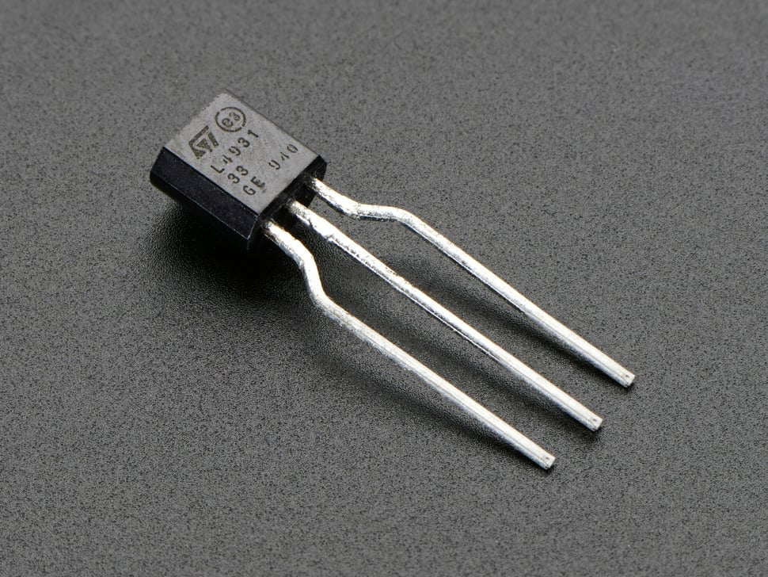</td>
      <td>
        - Cheaper than the others 
        - We have used it in a previous lab
      </td>
      <td>
        - Is through hole 
        - Not as efficient as it is linear
      </td>
      <td><a href="https://www.adafruit.com/product/2166?srsltid=AfmBOoqWcCuJELxtJVzFxIRpEGNKCCuCQmUOuTcbpZCLRW1pGNdhxgWv5Fo"> Datasheet</a></td>
    </tr>    
    <tr>
      <td colspan="5" style="text-align:center; font-weight:bold; background:#f0f0f0;">
        ✅ Our Choice: <u>LM2575D2T-3.3R4G</u> – Required part, proven in lab use, and reliable with heat dissipation.
      </td>
    </tr>
  </tbody>
</table>

<h2>Sensor Selection</h2>

<table>
  <thead>
    <tr>
      <th>Component</th>
      <th>Image</th>
      <th>Advantages</th>
      <th>Disadvantages</th>
      <th>Link</th>
    </tr>
  </thead>
  <tbody>
    <tr>
      <td><strong>HPP845E031R4</strong></td>
      <td>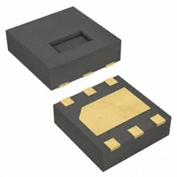</td>
      <td>
        - Has a heat sink 
        - Is surface mount
      </td>
      <td>
        - Has no external feet for soldering 
        - Will need to learn a new method of soldering to complete the project
      </td>
      <td><a href="https://www.digikey.com/en/products/detail/te-connectivity-measurement-specialties/HPP845E031R4/3945784">Datasheet</a></td>
    </tr>
    <tr>
      <td><strong>SHT21-TR</strong></td>
      <td>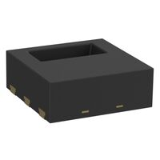</td>
      <td>
        - Has a heat sink 
        - Is surface mount 
      </td>
      <td>
        - Has no external feet for soldering 
        - Will need to learn a new method of soldering to complete the project 
        - Operates at a lower A
      </td>
      <td><a href="https://www.digikey.com/en/products/detail/sensirion-ag/SHT21-TR-0-4KS/5872245"> Datasheet</a></td>
    </tr>    
    <tr>
      <td><strong>ST0248</strong></td>
      <td>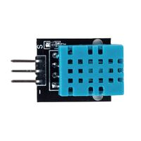</td>
      <td>
        - Will not need to buy 
        - Simpler soldering footprint
      </td>
      <td>
        - Is through hole 
        - Will take up lots of room on PCB
      </td>
      <td><a href="https://www.digikey.com/en/products/detail/sunfounder/ST0248/22116817?gclsrc=aw.ds&gad_source=1&gad_campaignid=20243136172&gbraid=0AAAAADrbLljrokQXUJCxtzhlniK662PLm&gclid=CjwKCAjw_-3GBhAYEiwAjh9fUFkM3ipS1jjoTkSoJ8_jWRjEfiZhy1Oncc5SdL8zCaNNATmc9wrYOxoC4T8QAvD_BwE"> Datasheet</a></td>
    </tr>    
    <tr>
      <td colspan="5" style="text-align:center; font-weight:bold; background:#f0f0f0;">
        ✅ Our Choice: <u>HPP845E031R4</u> – Surface mount option with heat sink, suitable for long-term use.
      </td>
    </tr>
  </tbody>
</table>

<h2>Motor Driver Selection</h2>

<table>
  <thead>
    <tr>
      <th>Component</th>
      <th>Image</th>
      <th>Advantages</th>
      <th>Disadvantages</th>
      <th>Link</th>
    </tr>
  </thead>
  <tbody>
    <tr>
      <td><strong>DRV8825PWPR</strong></td>
      <td>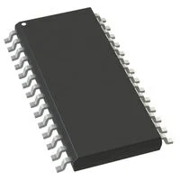</td>
      <td>
        - Has a heat sink 
        - Is surface mount 
      </td>
      <td>
        - Overkill for 1 motor 
        - Will take up lots of room on board, only needing 4 of its 28 pins
      </td>
      <td><a href="https://www.digikey.com/en/products/detail/texas-instruments/DRV8825PWPR/2695909">Datasheet</a></td>
    </tr>
    <tr>
      <td><strong>H-Bridge Motor</strong></td>
      <td>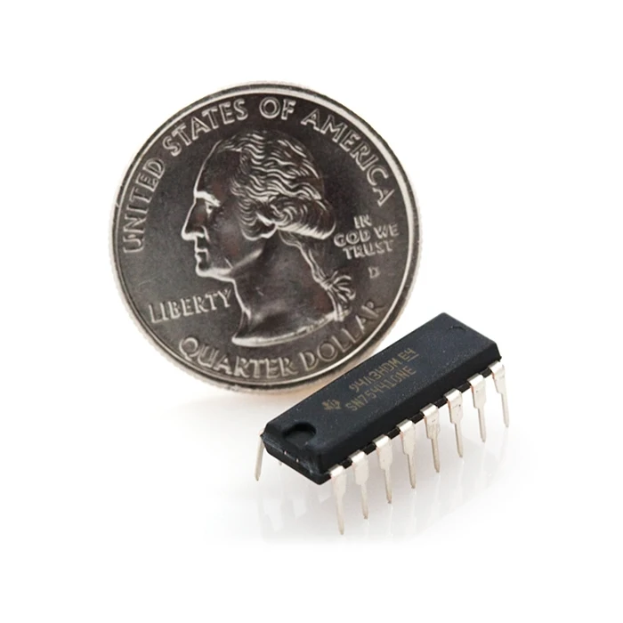</td>
      <td>
        - Have used in a previous lab 
        - Fewer pins to worry about
      </td>
      <td>
        - Is through hole 
        - No heat sink
      </td>
      <td><a href="https://www.sparkfun.com/h-bridge-motor-driver-1a.html"> Datasheet</a></td>
    </tr>    
    <tr>
      <td><strong>Dual H-Bridge Motor</strong></td>
      <td>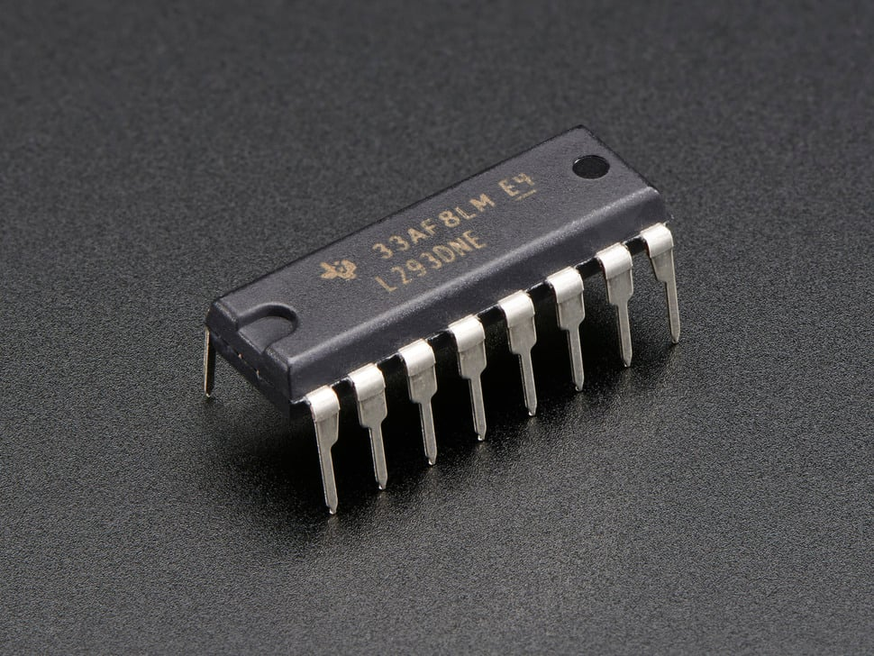</td>
      <td>
        - Have used in a previous lab 
        - Fewer pins to worry about
      </td>
      <td>
        - Is through hole 
        - No heat sink
      </td>
      <td><a href="https://www.adafruit.com/product/807?srsltid=AfmBOoouuligJwookAO5PMbB88Uj6VmlJy2_OE97h6Vdu7grntC-R9bXspE"> Datasheet</a></td>
    </tr>    
    <tr>
      <td colspan="5" style="text-align:center; font-weight:bold; background:#f0f0f0;">
        ✅ Our Choice: <u>DRV8825PWPR</u> – Surface mount driver with heat sink, most reliable for motor control.
      </td>
    </tr>
  </tbody>
</table>

<h2>Motor Selection</h2>

<table> 
  <colgroup>
    <col style="width:18%">
    <col style="width:18%">
    <col style="width:28%">
    <col style="width:28%">
    <col style="width:8%">
  </colgroup>
  <thead>
    <tr>
      <th>Component</th>
      <th>Image</th>
      <th>Advantages</th>
      <th>Disadvantages</th>
      <th>Link</th>
    </tr>
  </thead>
  <tbody>
    <tr>
      <td><strong>324</strong></td>
      <td></td>
      <td>
        - Cheapest of the motors 
        - has a good data sheet
      </td>
      <td>
        Limited torque 
        At higher RPM, the stepper has resonance issues
      </td>
      <td><a href="https://www.digikey.com/en/products/detail/adafruit-industries-llc/324/5022791">Datasheet</a></td>
    </tr>
    <tr>
      <td><strong>MOT-I-81619</strong></td>
      <td>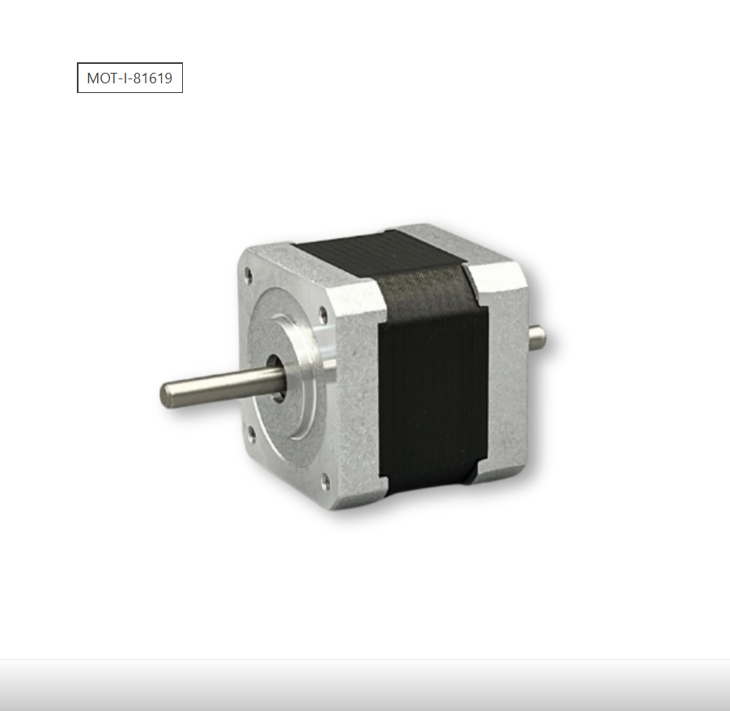</td>
      <td>
        Decent documentation 
        Easier for mechanical integration
      </td>
      <td>
        More expensive than the 324 
        Torque falls off at higher RPMs
      </td>
      <td><a href="https://www.digikey.com/en/products/detail/sparkfun-electronics/09238/5318747?gclsrc=aw.ds&gad_source=1&gad_campaignid=20243136172&gbraid=0AAAAADrbLljrokQXUJCxtzhlniK662PLm&gclid=CjwKCAjw_-3GBhAYEiwAjh9fUDY4mAaD5cVICg9DJ3dkp2tuUlxmwplDsnTPRYFdyZxFki9ZKPAaPRoC-vIQAvD_BwE"> Datasheet</a></td>
    </tr>    
    <tr>
      <td><strong>918</strong></td>
      <td></td>
      <td>
        can offer more torque 
        Good heat displacement  
      </td>
      <td>
        more complex to program 
        mounting may be more difficult
      </td>
      <td><a href="https://www.digikey.com/en/products/detail/adafruit-industries-llc/918/5629415?gclsrc=aw.ds&gad_source=1&gad_campaignid=20243136172&gbraid=0AAAAADrbLljrokQXUJCxtzhlniK662PLm&gclid=CjwKCAjw_-3GBhAYEiwAjh9fUGxSH1X5xyUS0WGCDu5T2N96eoFQoZ9U3X1nPWaGIcAxK6H59jPM1BoC19wQAvD_BwE"> Datasheet</a></td>
    </tr>    
    <tr>
      <td colspan="5" style="text-align:center; font-weight:bold; background:#f0f0f0;">
        ✅ Our Choice: <u>324</u> – Cheapest option with solid datasheet and sufficient performance for our project.
      </td>
    </tr>
  </tbody>
</table>

