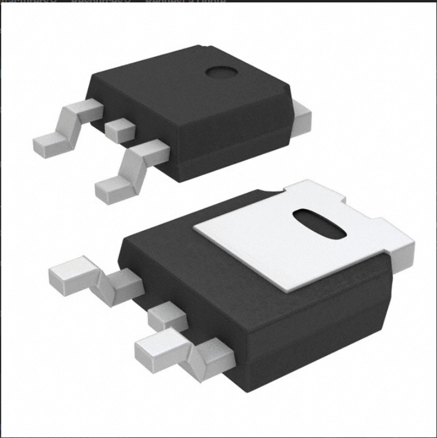
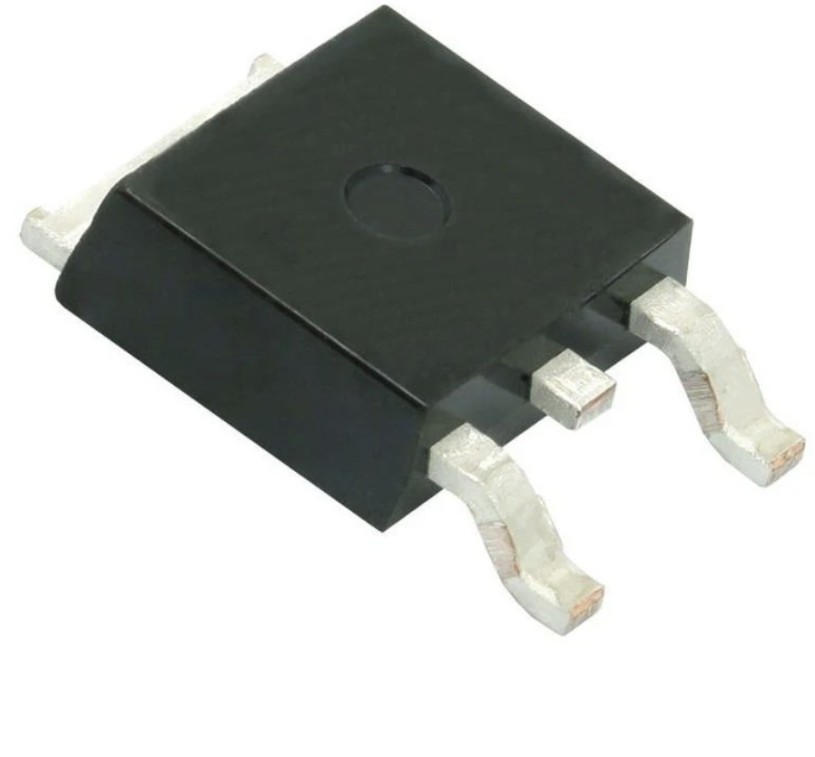
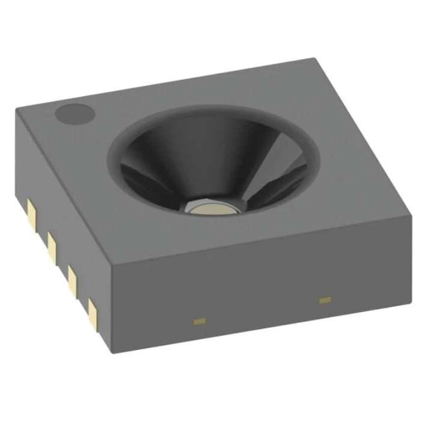
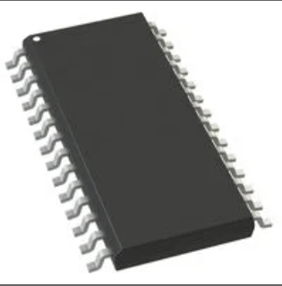
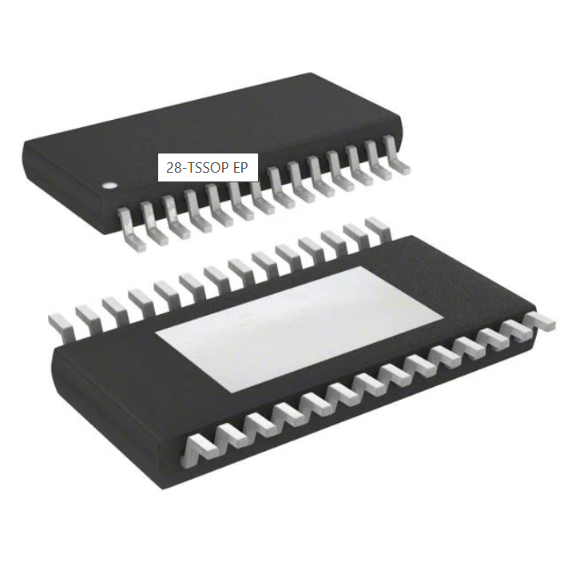
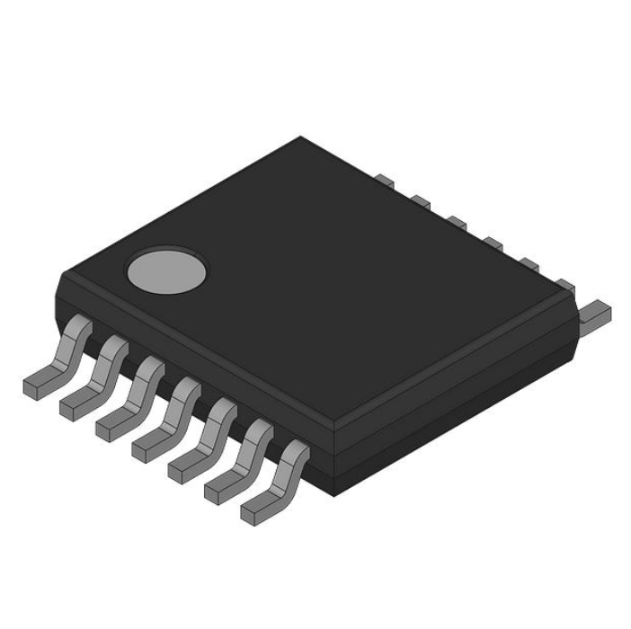
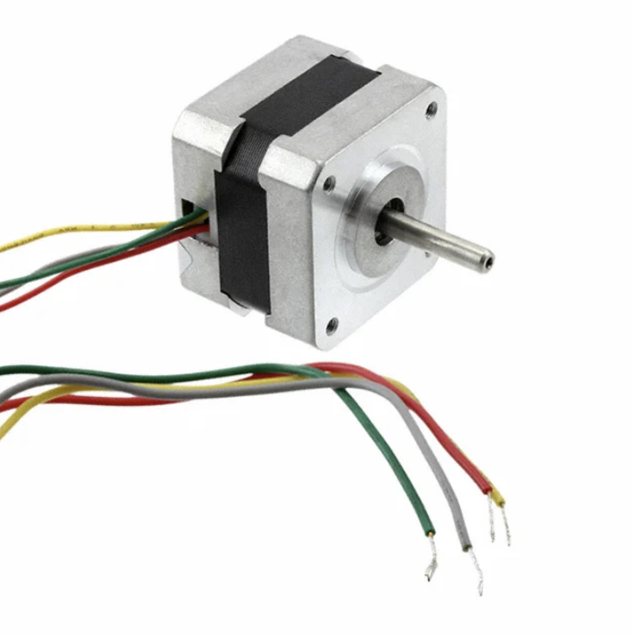
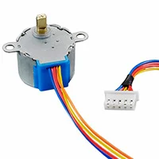

# Major Hardware Selection

 

<h2>Microcontroller Selection</h2>

<table>
  <thead>
    <tr>
      <th>Component</th>
      <th>Image</th>
      <th>Advantages</th>
      <th>Disadvantages</th>
      <th>Link</th>
    </tr>
  </thead>
  <tbody>
    <tr>
      <td><strong>ESP32-WROOM</strong></td>
      <td></td>
      <td>
        - Built in WiFi & Bluetooth 
        - Plenty of docs/examples 
        - Good peripherals for class labs 
        - Low power modes for IoT
      </td>
      <td>
        - Built in antenna 
        - Lower library ecosystem than ARM 
        - Higher power consumption in comparison to other MCUs
      </td>
      <td></td>
    </tr>
    <tr>
      <td><strong>Raspberry Pi 5</strong></td>
      <td></td>
      <td>
        - Large community and libraries 
        - Can handle advanced tasks like AI and image processing 
        - Considerably low power consumption
      </td>
      <td>
        - More power hungry 
        - More expensive than ESP32 or Arduino 
        - No built in WiFi/Bluetooth 
        - Overkill for simple sensor/motor tasks 
      </td>
      <td>
      </td>
    </tr>    
    <tr>
      <td><strong>Arduino Uno - R3</strong></td>
      <td></td>
      <td>
        - Large community and libraries 
        - Very low power consumption. 
        - Extremely simple 
      </td>
      <td>
        - Limited processing power 
        - No built-in Wi-Fi or Bluetooth 
        - Fewer GPIOs in comparison to the previous options
      </td>
      <td>
      </td>
    </tr>
  </tbody>
</table>

 <!-- The team selection -->
<h3>Our selection</h3>

<table>
  <colgroup>
    <col style="width:18%">
    <col style="width:18%">
    <col style="width:64%">
  </colgroup>
  <thead>
    <tr>
      <th>Component</th>
      <th>Image</th>
      <th>Justification</th>
    </tr>
  </thead>
  <tbody>
    <tr>
      <td><strong>ESP32-WROOM</strong></td>
      <td></td>
      <td>
        Our Choice: <u>ESP32-WROOM</u> – The team selected the ESP32-WROOM because it offers built-in Wi-Fi and Bluetooth, eliminating the need for external communication modules and reducing overall system complexity. Compared to the Raspberry Pi Pico and Arduino Uno R3, it delivers significantly higher processing power and more versatile peripherals, making it better suited for our project’s performance and connectivity requirements. Its balance of cost, features, and low-power capabilities makes it the most efficient choice amongst the three.
      </td>
    </tr>
  </tbody>
</table>

<h2>Power Regulator Selection</h2>

<table>
  <thead>
    <tr>
      <th>Component</th>
      <th>Image</th>
      <th>Advantages</th>
      <th>Disadvantages</th>
      <th>Link</th>
    </tr>
  </thead>
  <tbody>
    <tr>
      <td><strong>LM2575D2T-3.3R4G</strong></td>
      <td></td>
      <td>
        - Highly efficient, so less heat dissipation. 
        - Wide input voltage range, ideal when powered from 12V - 40V sources. 
        - 1A output current, which is suitable for powering microcontrollers, sensors, and small motors. 
        - Integrated switch, protection, and simple external parts. Needs only a diode, inductor, and two capacitors. 
      </td>
      <td>
        - More output ripple noise when compared to linear regulators. 
        - Switching EMI noise so how we design the layout on the PCB and decoupling are critical. 
        - Slightly more complex design. 
      </td>
      <td>
      </td>
    </tr>
    <tr>
      <td><strong>LF33ABDT-TR</strong></td>
      <td></td>
      <td>
        - Higher current capability than the L4931. 
        - Low dropout and low noise performance similiar to L4931. 
        - Good line and load regulation. 
        - Stable with just one 2.2 uF capacitor.
      </td>
      <td>
        - Its Linear topology makes it inefficient for high input/output differences.  
        - Will run hot under high current or a large voltage drop.
      </td>
      <td></td>
    </tr>    
    <tr>
      <td><strong>L4931</strong></td>
      <td></td>
      <td>
        - With a .4V dropout voltage, we can regulate with the small headroom. 
        - Simple design with just one 2.2uF capacitor for stability. 
        - Low noise output.
      </td>
      <td>
        - Efficiency is low for large voltage drops. 
        - Limited current which is not suitable for heavier loads. 
        - Power dissipation can get high.
      </td>
      <td></td>
    </tr>    
  </tbody>
</table>

<h3>Our selection</h3>

<table>
  <colgroup>
    <col style="width:18%">
    <col style="width:18%">
    <col style="width:64%">
  </colgroup>
  <thead>
    <tr>
      <th>Component</th>
      <th>Image</th>
      <th>Justification</th>
    </tr>
  </thead>
  <tbody>
    <tr>
      <td><strong>LM2575D2T-3.3R4G</strong></td>
      <td></td>
      <td>
        Our Choice: <u>LM2575D2T-3.3R4G</u> – Our team decided to go with the LM2575T because efficiency, current capacity and it has the highest input voltage range of the three. The LM2575T is slightly more expensive and requires a few additional external components, but performance and lower long-term power cost make it the most cost-effective and reliabe choice for our design.
      </td>
    </tr>
  </tbody>
</table>

<h2>Sensor Selection</h2>

<table>
  <thead>
    <tr>
      <th>Component</th>
      <th>Image</th>
      <th>Advantages</th>
      <th>Disadvantages</th>
      <th>Link</th>
    </tr>
  </thead>
  <tbody>
    <tr>
      <td><strong>HPP845E031R4</strong></td>
      <td></td>
      <td>
        - Fully calibrated & linearized digital ouput which means we can expect an easy integration vis I2C with no extra calibration needed. 
        - Extremely low current consumption which is suitable for our low-power IoT applications. 
        - Safe for long term production
      </td>
      <td>
        - Going to need some extra tools to solder onto board. 
        - Limited documentation on how to compnesate for the self-heating.
        - Fewer software libraries than the SHT21
      </td>
      <td></td>
    </tr>
    <tr>
      <td><strong>SHT21-TR</strong></td>
      <td></td>
      <td>
        - Excellent Accuracy. The sensor reads within +/- 2% of the true relative humidity value. 
        - Low power consumption. 
        - Well-documented interface and timing. Widely supported in linraries for arduino, ESP32, and STM32.
      </td>
      <td>
        - Slightly higher cost than the HPP845E031R4. 
        - Higher active current draw compared to the HPP845E031R4. 
        - Not as physically rugged. Recommends a protective filter membrane for harsh environments.
      </td>
      <td></td>
    </tr>    
    <tr>
      <td><strong>SHT30-DIS-B2.5KS</strong></td>
      <td></td>
      <td>
        - The 30 series for humidity sensors by Sensirion are genreally better in accuracy and comes with a tighter tolerance. 
        - Broader supply voltage can give more flexibility with system voltage rails. 
        - Although more expensive, the SHT30 can come with a metal case, making more rugged and reliable for outdoor use.
      </td>
      <td>
        - More complex features require careful implementaion 
        - Could be seen as overkill for what we are trying to accomplish. 
        - Small footprint package can make handling and soldering a bit more challenging.
      </td>
      <td></td>
    </tr>    
  </tbody>
</table>

<h3>Our selection</h3>

<table>
  <colgroup>
    <col style="width:18%">
    <col style="width:18%">
    <col style="width:64%">
  </colgroup>
  <thead>
    <tr>
      <th>Component</th>
      <th>Image</th>
      <th>Justification</th>
    </tr>
  </thead>
  <tbody>
    <tr>
      <td><strong>HPP845E031R4</strong></td>
      <td></td>
      <td>
        Our Choice: <u>HPP845E031R4</u> – We decided to move forward with the HPP845E031R4 because of its balance in performance, simplicity and cost. Like the SHT21, it provides accurate relative humidity and temperature readings, full digital I2C output, and a wide operating range of -40 degrees celsius to 125 degrees celsius. With a current consumption around .014mA, we are able to minimize power draw, which is valuable for embedded systems. While the newer SHT3x sensors can overachieve in all those categories, it comes with a notably higher price. The HPP845E031R4 will deliver the accuracy and reliability we need for our embedded system without overcomplicating the system or inflating project cost.
      </td>
    </tr>
  </tbody>
</table>

<h2>Motor Driver Selection</h2>

<table>
  <thead>
    <tr>
      <th>Component</th>
      <th>Image</th>
      <th>Advantages</th>
      <th>Disadvantages</th>
      <th>Link</th>
    </tr>
  </thead>
  <tbody>
    <tr>
      <td><strong>DRV8825PWPR</strong></td>
      <td></td>
      <td>
        - Wide voltage range of 8.2V - 45V. 
        - Compatible with many motor types and supply systems. 
        - High output current for reliable torque delivery. 
        - Simple STEP/DIR interface makes it easy to control from microcontrollers like the ESP32. 
        - Well-documented and widely supported in the maker and robotics communites.
      </td>
      <td>
        - Requires external sense resistors and tuning for current control 
        - Limited to 1/32 microstepping which is less precise than the L6470H. 
        - Needs proper PCB heat dissipation for high current loads.
      </td>
      <td></td>
    </tr>
    <tr>
      <td><strong>L6470H</strong></td>
      <td></td>
      <td>
        - Advanced motion control engine 
        - Manages acceleration, deceleration, speed, and position autonomously via SPI commands. 
        - High microstepping resolution(1/128) will enable a smoother and quiter motor operation. 
        - Sensorless stall detection for position awareness. 
      </td>
      <td>
        - Complex setup. 
        - Higher cost and component count than basic drivers. 
        - Not suited for quick prototyping. 
        - Slightly higher quiescent current draw than DRV8825.
      </td>
      <td></td>
    </tr>    
    <tr>
      <td><strong>Fan8100N</strong></td>
      <td></td>
      <td>
        - Dual-channel H-bridge can drive two DC motors or one motor in parallel up to 3A. 
        - Low-voltage operation, which makes it ideal for battery-powered systems. 
        - Simple Forward/Reverse/Brake control logic. 
        - With its low saturation voltage, it is guaranteed to be efficient at low voltages.
      </td>
      <td>
        - Designed for DC motors, not stepper motors. 
        - Limited voltage range with a max of 9V. 
        - Lower power handling than the DRV8825 or L6470H
      </td>
      <td></td>
    </tr>    
  </tbody>
</table>

<h3>Our selection</h3>

<table>
  <colgroup>
    <col style="width:18%">
    <col style="width:18%">
    <col style="width:64%">
  </colgroup>
  <thead>
    <tr>
      <th>Component</th>
      <th>Image</th>
      <th>Justification</th>
    </tr>
  </thead>
  <tbody>
    <tr>
      <td><strong>DRV8825PWPR</strong></td>
      <td></td>
      <td>
        Our Choice: <u>DRV8825PWPR</u> –  Our team decided that the DRV8825 is the ideal motor driver for our project. It provides a balance of cost, simplicity, and performance. It supports up to 2.5 A per phase with microstepping up to 1/32, providing smooth and precise motion control without complex configuration. Its STEP/DIR interface integrates easily with the ESP32, which can minimize programming and wiring effort. At a typical cost around $5-$8, it delivers strong reliability and efficiency at a fraction of the price.
      </td>
    </tr>
  </tbody>
</table>

<h2>Motor Selection</h2>

<table> 
  <colgroup>
    <col style="width:18%">
    <col style="width:18%">
    <col style="width:28%">
    <col style="width:28%">
    <col style="width:8%">
  </colgroup>
  <thead>
    <tr>
      <th>Component</th>
      <th>Image</th>
      <th>Advantages</th>
      <th>Disadvantages</th>
      <th>Link</th>
    </tr>
  </thead>
  <tbody>
    <tr>
      <td><strong>324</strong></td>
      <td></td>
      <td>
        - High torque density for its size. 
        - 4 x stronger than the MOT-I-81619. 
        - 1.8 degree step angle. 
        - Excellent thermal and mechanical stability
      </td>
      <td>
        - Slightly heavier 
        - Requires a driver with proper current control 
        - Higher cost than basic geared toy-grade steppers, but still mid-range overall. 
      </td>
      <td></td>
    </tr>
    <tr>
      <td><strong>MOT-I-81619</strong></td>
      <td></td>
      <td>
        - Standard NEMA-17 which makes it compatible with most mounts. 
        - Moderate torque which makes it suitable for light mechanical systems
        - Low current draw of .33A
        - Simple 2-phase bipolar wiring
      </td>
      <td>
        - Lower torque output than our 324 model 
        - Inductance may limit speed response and acceleration. 
      </td>
      <td></td>
    </tr>    
    <tr>
      <td><strong>918</strong></td>
      <td></td>
      <td>
        - Very compact and lightweight. 
        - Ideal for small beginners and small projects. 
        - Works easily with Arduino Motor Shields or other low-voltage drivers.  
      </td>
      <td>
        - Very low torque. 
        - slow speed. 
        - Geared design reduces efficiency and introduces backlash in precision applications.
      </td>
      <td></td>
    </tr>    
  </tbody>
</table>

 <h3>Our selection</h3>

<table>
  <colgroup>
    <col style="width:18%">
    <col style="width:18%">
    <col style="width:64%">
  </colgroup>
  <thead>
    <tr>
      <th>Component</th>
      <th>Image</th>
      <th>Justification</th>
    </tr>
  </thead>
  <tbody>
    <tr>
      <td><strong>324</strong></td>
      <td></td>
      <td>
        Our Choice: <u>324</u> –  Our group will go with the 324 motor or better known as the 42mm hybrid high torque stepper motor because of the combination of torque, precision and compatibility for our project. With the 1.8 degree steps, it ensures precise motion control, while its 1.6 kg·cm holding torque delivers sufficient strength for mechanical loads without excessive current draw. Its ability to pair with the DRV8825 motor driver provides us with a simple guide on the wiring and reliability when it comes to perfomance at the 12V. Though slightly more expensive than a smaller hobby stepper motor, its superior torque output and robust construction make it the most cost-effective and capable option for consistent, high-accuracy operation in our system. 
      </td>
    </tr>
  </tbody>
</table>

<h2>Power Budget</h2>

<table>
  <colgroup>
    <col style="width:18%">
    <col style="width:18%">
    <col style="width:28%">
    <col style="width:28%">
  </colgroup>
  <thead>
    <tr>
      <th>Component</th>
      <th>Minimum Draw</th>
      <th>Maximum Draw</th>
      <th>When</th>
    </tr>
  </thead>
  <tbody>
    <tr>
      <td><strong>ESP32</strong></td>
      <td>0.5A</td>
      <td>1.3A</td>
      <td>typical (1.3A is worst case scenario)</td>  
    </tr>
  </tbody>
</table>

## Bill Of Materials

  <iframe
    src="/EGR314-2025-F-310/Images/BOM.pdf#view=FitH"
    width="100%"
    height="100%"
    style="border:1px solid #ddd;"
  ></iframe>

<a href="/EGR314-2025-F-310/Images/BOM.pdf" target="_blank" rel="noopener">
  Open full-size PDF in new tab
</a>

